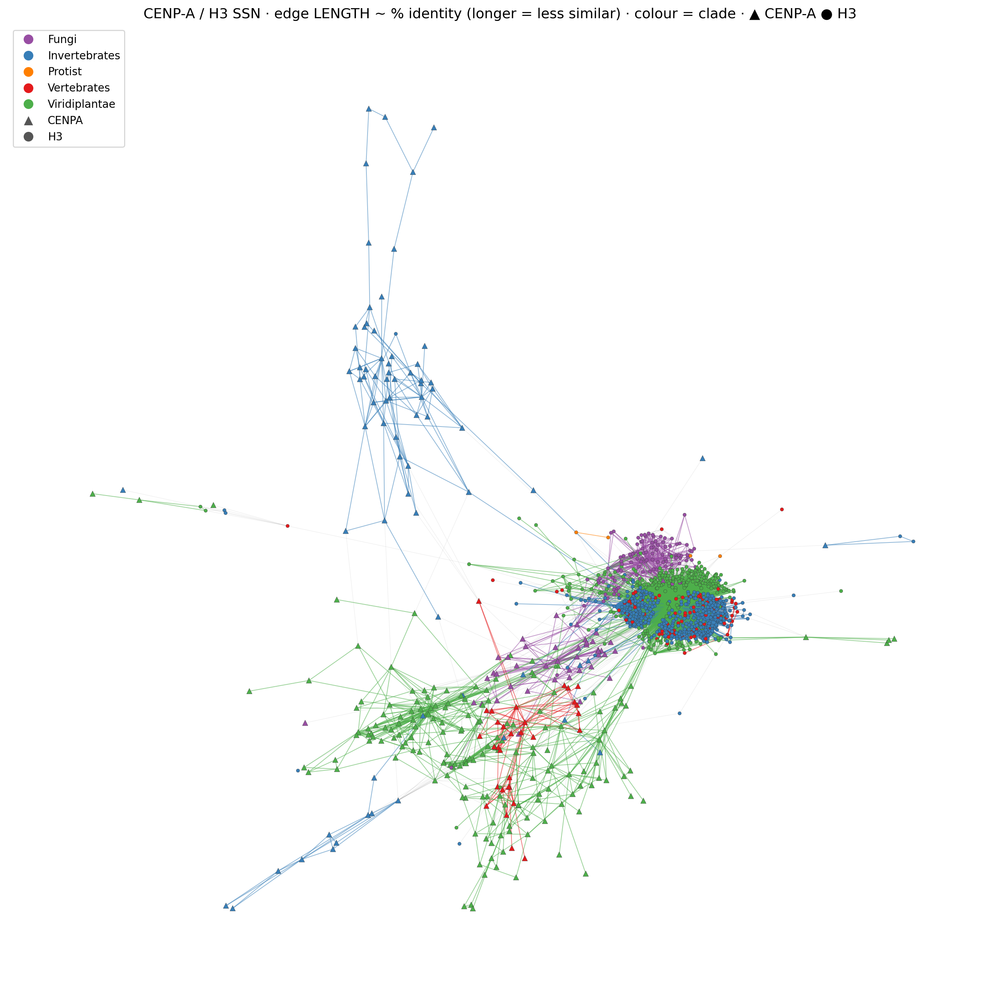

# Case study — CENP-A/CENH3 vs H3, coloured by clade

A real-data example of `proteinssn` on **1,319 histone sequences** (422 CENP-A/CENH3 +
897 canonical H3) from 325 eukaryotic genomes (Darwin Tree of Life centromere study),
coloured by **taxonomic clade** rather than by cluster.

Here **edge length reflects % identity** — the more similar two proteins, the shorter the
edge pulling them together (so *longer edge = less similar*):



## What it shows
- **H3 (● circles) collapses into a tight, dense core** — canonical H3 is so conserved that
  almost all 897 sequences are mutually similar (short, strong edges), forming one compact ball.
- **CENP-A/CENH3 (▲ triangles) radiates outward into clade-specific arms** on long edges — the
  fast-evolving centromeric variant is dispersed and groups by clade (Invertebrates blue,
  Viridiplantae green, Vertebrates red, Fungi purple).
- **Edge colour** = clade of the two endpoints (within-clade edges take the clade colour,
  cross-clade edges are faint grey).

That contrast — conserved H3 core vs divergent, clade-structured CENP-A — is the whole point.

Three layout variants are included: `cenpa_h3_by_clade.png` (organic ForceAtlas2, length not
meaningful), `cenpa_h3_by_identity.png` (edge length ~ % identity) and
`cenpa_h3_by_evalue.png` (edge length ~ e-value significance).

## Files
| file | what it is |
|---|---|
| `cenpa_h3.faa` | the 1,319 sequences (input) |
| `clade.tsv` | per-sequence metadata: `name · clade · group` (CENP-A vs H3) |
| `color_by_metadata.py` | colour any `proteinssn` network by an external metadata table |
| `cenpa_h3_by_clade.png` | the figure above |

## Reproduce
```bash
# 1. build the network (all-vs-all DIAMOND; CENP-A and H3 are homologous, so use a
#    higher identity than the 30% default to resolve them)
ssn build cenpa_h3.faa -i 35 -c 50 -o cenpa_ssn

# 2. colour by clade, with edge LENGTH ~ % identity (longer edge = less similar)
python color_by_metadata.py cenpa_ssn/cenpa_h3.edges.tsv clade.tsv cenpa_h3_by_identity.png \
  --color-col clade --shape-col group --giant-only --edge-length identity

#    ...or edge length ~ e-value significance, or the plain organic layout:
python color_by_metadata.py cenpa_ssn/cenpa_h3.edges.tsv clade.tsv cenpa_h3_by_evalue.png \
  --color-col clade --shape-col group --giant-only --edge-length evalue
python color_by_metadata.py cenpa_ssn/cenpa_h3.edges.tsv clade.tsv cenpa_h3_by_clade.png \
  --color-col clade --shape-col group --giant-only
```

`color_by_metadata.py` is generic: give it any `*.edges.tsv` and a metadata table whose first
column matches the sequence names, then pick a `--color-col` (and optionally a `--shape-col`).
- `--edge-length identity|evalue` makes edge **length** reflect similarity via a weighted spring
  layout (shorter = more similar / more significant; longer = less similar). Default `none` uses
  the organic ForceAtlas2 layout, where length is not quantitative.
- `--giant-only` plots just the largest connected component (otherwise the singletons and tiny
  clusters are flung to the periphery); drop it to show everything.
